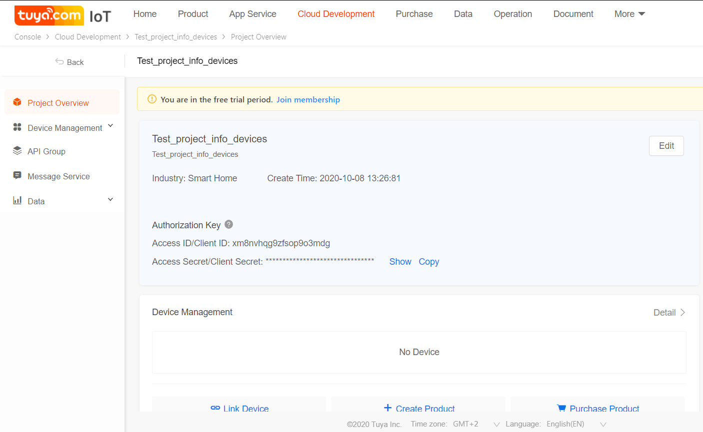
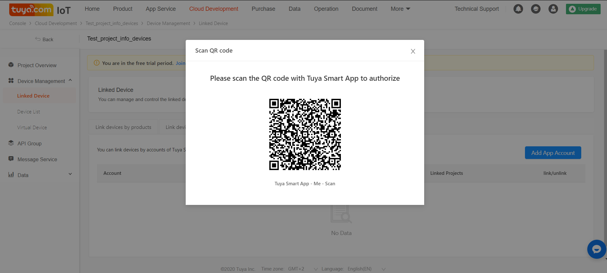
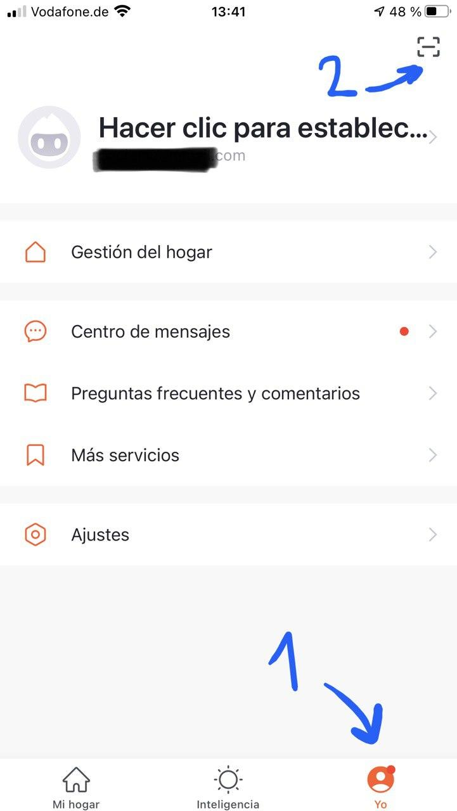
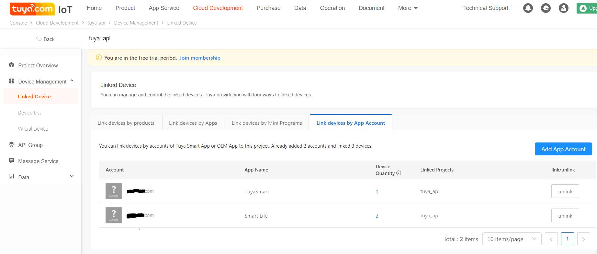
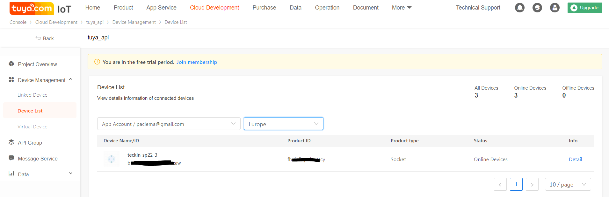

# tuya_powermonitor
Service that reads tuya devices status and save it into an influxdb database.

#Installation:

## Configure your devices:

In order to communicate with tuya devices we need to get for each device:
* Device ID: check the virtual ID under tuya mobile app information after register the device or follow the next steps.
* Device IP: check your router after setup your device.
* Device version (3.3 on my devices)
* Device key: this is tricky, follow the next steps.


### 1. Configure Tuya iot platform:

1. Install tuya devices using Tuya / Smart Life mobile app and make them work using the official app.

2. Create a developer account on [iot tuya platform](https://iot.tuya.com/).

3. Create new project on [Cloud Development](https://iot.tuya.com/cloud/)

You will need the _Access ID/Client ID_ and the _Access Secret/Client Secret_ for later.

4. Under _Device Management_ of your new project, go to _Linked Device_, select the tab _Link devices by App Account_ and click on _Add App Account_.

It will popup a QR code to authorize your project to access to your devices registered within Tuya mobile app from step 1.

5. Scan QR using Tuya app and confirm your session.


6. You can check now your account linked on your iot tuya platform under _Device Management_ selecting your location properly.


7. Check the devices attached to the project and their _Device ID_.



### 2. Get device key:

1. Install tuya-cli from [github.com/TuyaAPI/cli](https://github.com/TuyaAPI/cli) using npm:
`npm i @tuyapi/cli -g`
2. Run the wizard and use the _Access ID_ and _Access Secret_ of the project that you create previously on iot tuya platform and the _Device ID_ of one of your authorized devices :
```console
>tuya-cli wizard
? The API key from tuya.com: ejfc**********wrhz
? The API secret from tuya.com e04*****************5b5e
? Provide a 'virtual ID' of a device currently registered in the app: bf7a6********zzaw
[
  {
    name: 'teckin_sp22_3',
    id: 'bf7a6********zzaw',
    key: '****************'
  }
]
```
Note down the key received for the id device.

### 3. Get device data:

```console
$ tuya-cli get --id bf7a6********zzaw --key e3f************* --ip 192.168.1.165 --protocol-version 3.3 -a
{
  dps: {
    '1': true,
    '9': 0,
    '17': 3,
    '18': 37,
    '19': 51,
    '20': 2274,
    '21': 1,      ----> test bit
    '22': 609,    ----> voltage coe Voltage calibration factor
    '23': 32031,  ----> electric coe. Current calibration factor
    '24': 18181,  ----> power coe. Power calibration factor
    '25': 1148,   ----> Electricity. Calibration coefficients for electrical energy
    '26': 0
  }
}
```


Use [github.com/jasonacox/powermonitor](https://github.com/jasonacox/powermonitor) to get the device data.


More info: https://www.youtube.com/watch?v=oq0JL_wicKgµ
